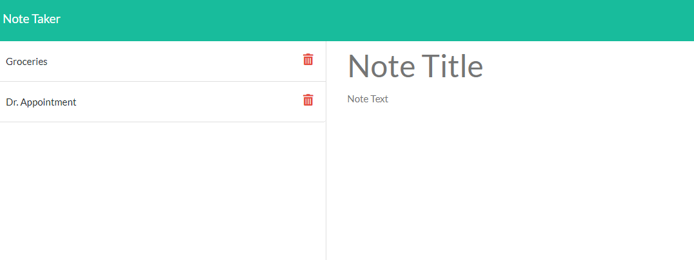

# Note Taker

## Overview
This assignment asked us to modify starter code to create a note taking application using Express back end and data storage in a JSON file. The application allows you to type information in two fields, note title and note text. The save button will appear when text is entered in both fields, allowing you to store the note. Once saved, the note title appears in the left column; clicking on the title will generate the note title and text in the right column. The entire application is launched on Heroku.

## Application Link
[Note Taker](https://ancient-cove-61796.herokuapp.com/)

## Primary Technologies Used
* Node
* Express
* Uniqid
* Javascript

## Preview
